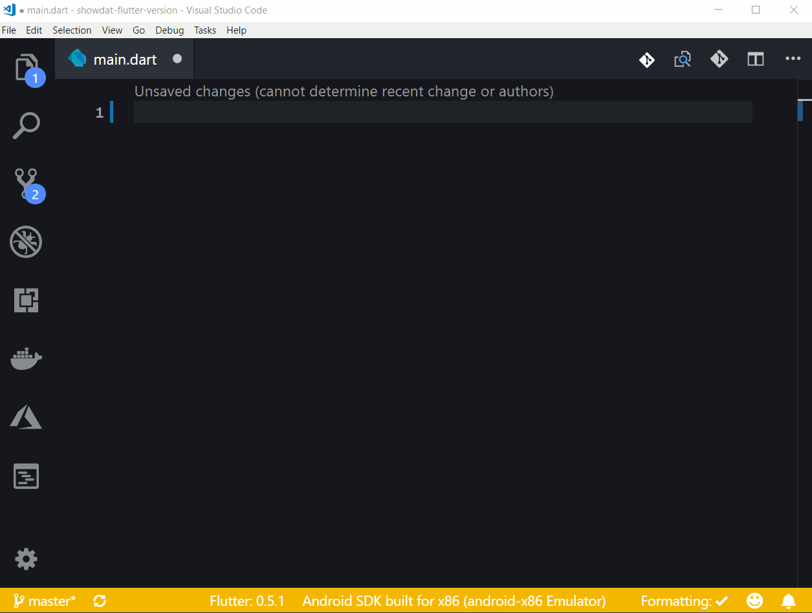

# README

A set of helpful Flutter and Dart snippets for day to day Flutter development.

## Features

Simply Flutter set of snippets

I'm working hard to select all the day to day widgets, so wait for more!.

### Snippets

### Flutter related snippets

| Snippet     | Description                                                                      |
| ----------- | -------------------------------------------------------------------------------- |
| `fscaff`    | Scaffold widget snippet                                                          |
| `fstfulapp` | StatefulWidget snippet App                                                       |
| `fstless`   | StatelessWidget snippet                                                          |
| `fedgall`   | EdgeInsets widget snippet with named constructor `all`                           |
| `fedgonly`  | EdgeInsets widget snippet with named constructor `only`                          |
| `ftxt`      | Text widget snippet                                                              |
| `finitlf`   | Flutter initState lifecycle method snippet                                       |
| `fic`       | Flutter Icon widget snippet                                                      |
| `fcont`     | Flutter Container widget snippet                                                 |
| `fcent`     | Flutter Center widget snippet                                                    |
| `frow`      | Flutter Row widget snippet                                                       |
| `fcol`      | Flutter Column widget snippet                                                    |
| `fex`       | Expand widget snippet                                                            |
| `fszbw`     | SizedBox widget snippet with just width argument                                 |
| `fszbh`     | SizedBox widget snippet with just height argument                                |
| `fszb`      | SizedBox widget with width and height arguments                                  |
| `fedgsym`   | EdgeInsets widget with named constructor `symmetric`                             |
| `fedgsymv`  | EdgeInsets widget with named constructor `symmetric` with `vertical` parameter   |
| `fedgsymh`  | EdgeInsets widget with named constructor `symmetric` with `horizontal` parameter |
| `fimpmat`   | Add material's package import statement                                          |

### Dart related snippets

| Snippet    | Description                                        |
| ---------- | -------------------------------------------------- |
| `dvar`     | Dart variable declaration using `var`              |
| `dfinal`   | Dart variable declaration using `final`            |
| `dconst`   | Dart variable declaration using `const`            |
| `dinvar`   | Dart Public Instance variable snippet              |
| `dprinvar` | Dart Private instance variable snippet             |
| `dmt`      | Dart public method snippet                         |
| `dprmt`    | Dart private method snippet                        |
| `darr`     | Dart public arrow function snippet                 |
| `dprarr`   | Dart private arrow function snippet                |
| `dopnctor` | Dart optional named parameters constructor snippet |
| `dlist`    | Dart `List` collection snippet                     |
| `dmap`     | Dart `Map` collection snippet                      |
| `dset`     | Dart `Set` collection snippet                      |
| `dgetarr`  | Dart arrow function getter snippet                 |
| `dimpas`   | Dart `import as` snippet                           |
| `dimpshow` | Dart `import show` snippet                         |
| `dimplazy` | Dart `import deffered as` snippet                  |
| `dimphide` | Dart `import hide` snippet                         |
| `dexhide`  | Dart `export hide` snippet                         |
| `dexshow`  | Dart `export show` snippet                         |
| `dconvert` | Dart `convert` lib import snippet                  |

## Release Notes

## 2.0.0

- Features
  - remove `fstfulapp` and `fstless` since DartCode extension already has them.
  - add `fimpmat` snippet that add material package import statement.
  - remove body content from `fscaff` snippet to a more generic value.

### 1.1.0

- Features:
  - add `dimpas`, `dimpshow`, `dimplazy`, `dimphide` import snippets.
  - add `dexhide` and `dexshow` export snippets.
  - add `dmt` public method snippets.
  - add `convert` lib import snippet.
  - add `dvar`,`dfinal` and `dconst` variable declaration snippets.
  - add `darr` and `dprarr` arrow function snippets.

### 1.0.0

- Fixes:
  - add the material package import to fstless snippet.
- Refactors:
  - change the type of `dinvar` and `dprinvar` to a more generic one (dynamic) and remove the initialization.
  - remove the semicolon to `dinvar` snippet to allow use case when we want to use it as a function parameter.
- Docs:
  - organize the Flutter and the Dart snippets
  - change the render header to description
- Features:
  - add Dart `List`, `Map` and `Set` collection snippets
  - add Dart arrow function getter snippet

### 0.0.3

- Fixes
  - Typos
- New snippets:
  - fedgsym - EdgeInsets widget with named constructor `symmetric`
  - fedgsymv - EdgeInsets widget with named constructor `symmetric` with `vertical` parameter
  - fedgsymh - EdgeInsets widget with named constructor `symmetric` with `horizontal` parameter
- Special thanks to:
  - [Ajil Ooommen](https://github.com/ajilo297): Add fedgsym, fedgsymv, fedgsymh snippets.

### 0.0.2

- New Snippets:
  - fex - Expand widget snippet
  - fszbw - SizedBox widget snippet with just width argument
  - fszbh - SizedBox widget snippet with just height argument
  - fszb - SizedBox widget with width and height arguments
  - fedgonly - EdgeInsets widget snippet with named constructor `only`
- Renamed snippets:
  - fedgeiallw -> fedgall
  - froww -> frow
  - fcolw -> fcol
  - fcontw -> fcont
  - fcentw -> fcent
  - fwscaffoldw -> fscaff
  - fstlessw -> fstless
  - fstfulwapp -> fstfulapp
  - ftxtw -> ftxt
  - finitlfm -> finitlf
  - ficw - fic
- Fixes:
  - path of the gif image

### 0.0.1

Initial release
